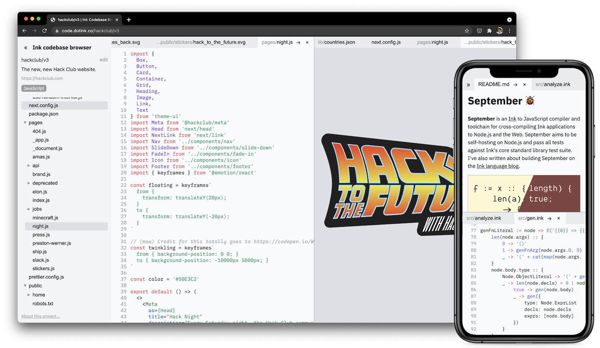
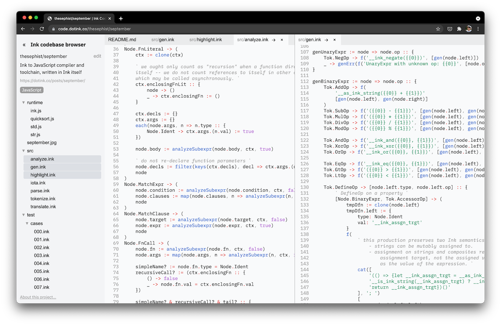
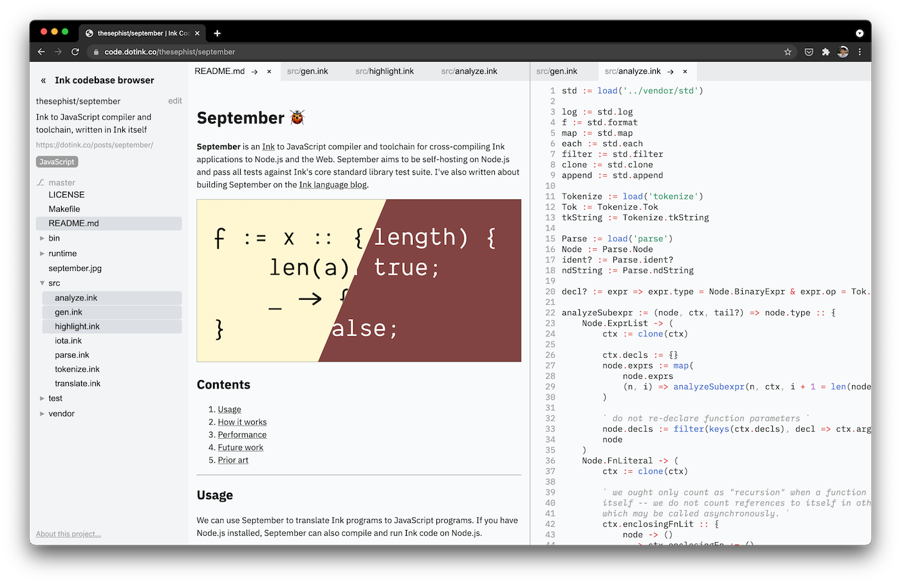
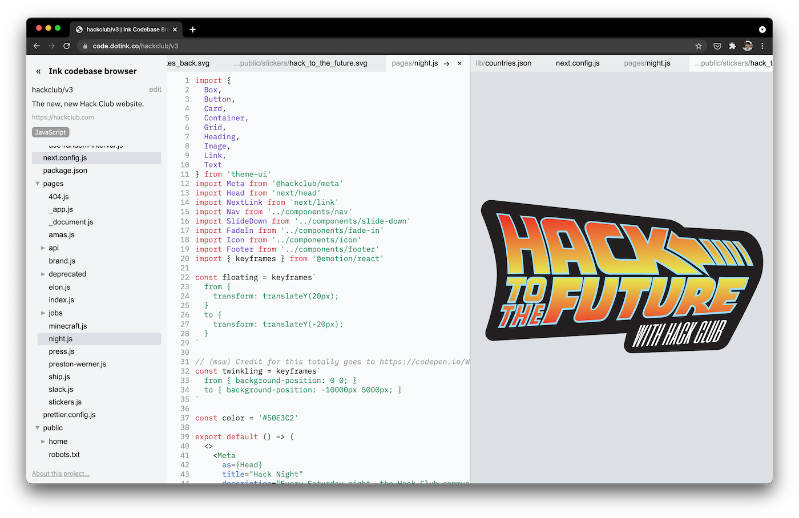
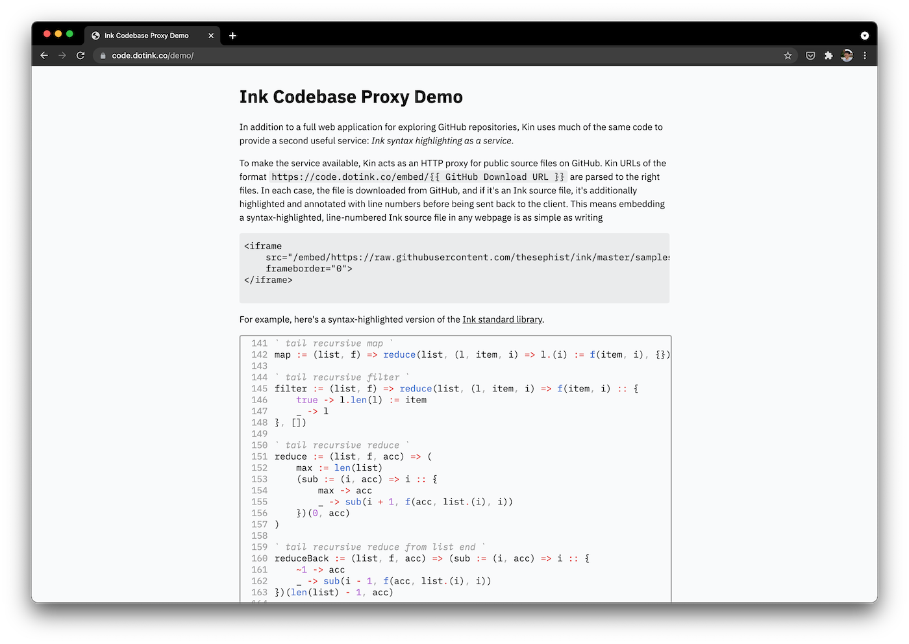

# Ink codebase browser, _"Kin"_ 🔍

The **Ink codebase browser** is a tool to explore open-source code on GitHub, especially my side projects written in the [Ink](https://dotink.co) programming language. It offers multi-pane, multi-tab interfaces for looking at source code from projects on GitHub, and generates Markdown previews and syntax highlighting for many languages including Ink.

The codebase browser is a full-stack Ink application. It's written in pure Ink except for the syntax highlighting library used to highlight non-Ink source code ([highlight.js](https://highlightjs.org/)) and [Torus](https://github.com/thesephist/torus) used as the UI rendering backend. In addition to these libraries, the project leans on [September](https://github.com/thesephist/september) for building the frontend and for syntax highlighting Ink source code; and it depends on [Merlot](https://github.com/thesephist/merlot) for rendering Markdown file previews.

**"Kin"** was my codename for the project before I gave it its final name of the Ink codebase browser — I liked the name because it's an anagram of "ink", and it's short.
## Features

There are three main problems I wanted to solve with the codebase browser.

1. Most of my side projects written in Ink are open-source on GitHub, but GitHub doesn't (yet) **syntax highlight Ink source code**. This makes Ink code harder to read on GitHub than it has to be.
2. GitHub's **file browser interface** isn't great for just exploring the file hierarchy of a project. Compared to modern code editors, with a file tree sidebar, multi-pane and multi-tab layouts,
3. Frequently, I find myself needing to reference Ink source files on my GitHub from elsewhere on the Internet like a blog, and I'm disappointed that I can't simply link to a line-numbered, syntax-highlighted file preview. I wanted some way to **embed Ink source files** from other webpages.

The codebase browser solves all of these problems through the main interface and the "proxy" service described below. In addition, to improve the experience of looking around a project the app supports some extra features initially unplanned. Some of these are described below.
### Ink syntax highlighting

The codebase browser uses [September](https://github.com/thesephist/september)'s Ink syntax highlighting algorithm to syntax highlight Ink programs. The algorithm is compiled to JavaScript so it can run fully in the browser.

### Rich file previews

The codebase browser recognizes four different types of files

1. Binary "blob" files, which are ignored for the purpose of the file preview
2. Image files which are displayed as images in the preview
3. Text files, which are displayed with line numbers and syntax highlighting, if the language can be detected
4. Markdown files, which are rendered as their compiled versions with [Merlot](https://github.com/thesephist/merlot)'s Markdown engine (note that Merlot isn't fully compliant with any common Markdown spec -- it mostly just has the subset that I use, though it's being improved.)

You can see an example Markdown file preview above, next to an Ink source file that's been syntax highlighted. Below, we have a TypeScript React file next to an image preview.

File previews require the full file to be fetched from GitHub and potentially parsed locally, so files larger than 1MB are not rendered.

### File tree and multi-pane multi-tab layout

As we can see above, Ink codebase browser lets us browse files in a GitHub repository as if we have a text editor or IDE open to the project on a filesystem. Compared to GitHub's browsing interface, where each page can only show one folder and file at a time, this interface with multiple panes and tabs makes it much easier to explore and read source code.

>⚠ _Tabs and panes can't be drag-and-dropped to rearrange them. I'm not sure if I'll bother adding that functionality, to be honest. But for now, all files initially open in the leftmost/topmost pane, and can be moved to other panes with the right arrow (→) button._

## Syntax highlighting as a service

The Ink codebase browser has a less obvious second feature, which is what I call _syntax highlighting as a service_.

I frequently want to show some bit of Ink program online, on one of my technical blogs or linked from a comment or tweet, but simply linking to a file or a GitHub preview is suboptimal because Ink has no syntax highlighting support in most places. Given that this project already had a way to syntax highlight Ink code for the web, I chose to repurpose this code to make a service that acts as an HTTP proxy that highlights any Ink code passing through it.

Using this "proxy" service, I can embed links to syntax-highlighted versions of Ink source files that live on my GitHub repositories. For example, above is a sample document that takes advantage of this. You can see a live demo at [code.dotink.co/demo](https://code.dotink.co/demo).

## Architecture

The Ink codebase browser is a full-stack Ink application. The backend is written in Ink as a single HTTP monolithic server, serving a few different API routes to interface with GitHub's API and act as the syntax highlighting proxy. The frontend is an Ink application that renders to the DOM using a [Torus](https://github.com/thesephist/torus) compatibility layer. I've used this approach a few times now, with other projects like [Merlot](https://github.com/thesephist/merlot) and the [Ink playground](https://github.com/thesephist/maverick).

The backend is a simple HTTP server. In addition to serving static files, it provides a few internal API endpoints that map 1:1 to specific GitHub API endpoints but translate and filter API responses to the specific data needed by the client-side UI.

There are a few different pieces of [isomorphic](https://dotink.co/posts/eliza/) Ink code being used in the codebase browser. Much of the standard library is, obviously, cross-compiled to JavaScript. But the syntax highlighting library from the September compiler toolchain is both compiled to JavaScript and run natively on the backend, and the Markdown engine from Merlot is also compiled down for the browser.

## Development

Kin uses a Makefile for development tasks. To develop Kin, you'll need to install [Ink](https://dotink.co/) and the [September](https://github.com/thesephist/september) compiler. [inkfmt](https://github.com/thesephist/inkfmt) is optional, and used for code formatting.

- `make run` starts the web server in the same way as the production environment. To run the server, you'll need to replace the dummy token in `secrets.sample.ink` with your GitHub access token and copy it to `secrets.ink`.
- `make watch` runs `make build` every time a relevant Ink source file in `./src` or `./lib` changes.
- `make check` or `make t` runs unit tests, which lives in `test/`.
- `make fmt` runs the [inkfmt](https://github.com/thesephist/inkfmt) code formatter over all Ink source code in the project.

### Build tasks

Because of the number of dependencies in this project, Kin has a multi-part build process. We first build four different components (three of which change rarely), and bundle them into one production bundle at the end.

- `make build-libs`, `make build-september` and `make build-merlot` perform builds of different dependencies of Kin -- standard library dependencies, and dependencies from September and Merlot (syntax highlighter and Markdown engine).
- `make build` builds the frontend JavaScript bundle from `./src/app.js.ink`.
- `make build-all` performs a fresh build, assuming all sibling dependencies (September and Merlot) are present next to this project's root directory on your system.

September and Merlot are development-time dependencies for this project, but these libraries are compiled to JavaScript vendored into the project, so for normal builds using just `make build`, they are not necessary to be on your machine.
